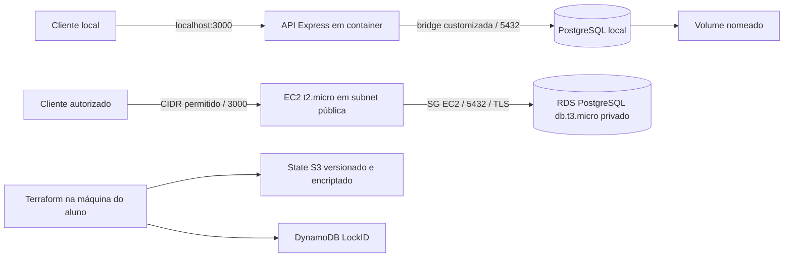

# Design revisado — API de Reservas

Este documento descreve como cumprir R01–R32 de [requirements.md](requirements.md).
As decisões D01–D15 são nossas escolhas, não regras adicionais atribuídas ao
professor. Em 28/09/2026, o aluno revisou as specs e alterou o formato externo de
data para `DD-MM-YYYY`; a decisão D02 foi atualizada. T06 implementou schema,
conexão e testes locais; rotas HTTP e infraestrutura ainda são futuras. Planos
AWS e destruição continuam sujeitos a revisão/autorização.

## Arquitetura e estrutura



D01: manter a organização do enunciado. A futura estrutura inclui `app/src/`,
`app/package.json`, lockfile npm, `app/Dockerfile`, `app/.dockerignore`,
`docker-compose.yml`, `.env.example`, `.gitignore`, `README.md`, `relatorio.md`,
`infra/{main,variables,outputs,providers}.tf`, os quatro módulos e `infra/backend/`.
Acrescentar `app/sql/001-reservas.sql`, testes em `app/test/`, `scripts/` de
verificação, `docs/diario-ia.md` e `evidencias/`. Esses complementos organizam a
validação; não constituem entregas extras exigidas pelo professor.

## Contrato HTTP e dados

D02 (revisada em 28/09/2026): `data` é uma data civil sem horário, recebida e
devolvida em JSON como string `DD-MM-YYYY`, com dois dígitos para dia/mês e
quatro para ano (0001–9999). Exemplo: `15-10-2026`. Validar o calendário e anos
bissextos antes de gravar; não impor data futura. Não aceitar formato ISO no
contrato externo, dia/mês sem zero à esquerda, horário ou normalização automática
que transforme data impossível em outro dia.

PostgreSQL mantém o tipo `DATE`. A aplicação separa dia/mês/ano explicitamente,
valida os componentes e envia `YYYY-MM-DD` como parâmetro SQL interno; nas
consultas/RETURNING, formatar a data para `DD-MM-YYYY`, por exemplo com
`to_char(data, 'DD-MM-YYYY') AS data`. Não usar `new Date(texto)` para interpretar
esse formato nem depender de DateStyle/localidade/fuso. O ISO é apenas uma
representação interna para a escrita SQL, nunca a resposta da API.

Casos futuros de integração: aceitar `29-02-2024`; rejeitar `29-02-2025`,
`31-04-2026`, `2026-10-15`, `1-2-2026` e data com horário. POST, GET de lista,
GET por ID e PUT devem devolver a mesma data válida em `DD-MM-YYYY`; entrada
rejeitada não pode alterar o banco. Estes testes ainda não foram executados.

D03: `cliente` é string com espaços externos removidos, entre 1 e 120 caracteres
Unicode; rejeitar null, valores não string e texto vazio. `status` é obrigatório,
exatamente `pendente`, `confirmada` ou `cancelada`. Não há status padrão nem
transições de estado especiais. São escolhas simples para validação previsível.

D04: POST e PUT recebem objeto JSON contendo exatamente `cliente`, `data` e
`status`, todos obrigatórios; rejeitar campos desconhecidos, inclusive `id`.
PUT substitui integralmente os três campos editáveis, preservando o ID; não há
PATCH nem atualização parcial. `id` é inteiro positivo gerado pelo banco
(1–2147483647); parâmetro de rota inválido retorna 400 antes de executar SQL.
JSON malformado/campos inválidos retornam 400; Content-Type inadequado retorna
415, corpo acima de 16 KiB retorna 413. Não acrescentar autenticação nesta prova.

Exemplo de corpo válido (dados fictícios de teste):

```json
{"cliente":"Cliente de teste","data":"15-10-2026","status":"pendente"}
```

| Método / rota | Sucesso e resposta | Falha prevista |
|---|---|---|
| POST `/reservas` | 201; objeto com os quatro campos; `Location: /reservas/<id>`. | 400/413/415; nenhuma linha inserida quando rejeitado. |
| GET `/reservas` | 200; array de objetos ordenado por ID crescente, inclusive `[]`. | 503 se banco indisponível. |
| GET `/reservas/:id` | 200; objeto com os quatro campos. | 400 ID inválido; 404 inexistente. |
| PUT `/reservas/:id` | 200; objeto atualizado; uma linha alterada, mesmo ID. | 400/413/415; 404 inexistente; sem alterações na falha. |
| DELETE `/reservas/:id` | 204, sem corpo; remoção física. | 400 ID inválido; 404 inexistente, inclusive segundo DELETE. |
| GET `/health` | 200 `{"status":"ok","database":"ok"}` se `SELECT 1` funcionar. | 503 `{"status":"unavailable","database":"unavailable"}` se banco falhar. |

D05: `/health` verifica conexão real ao banco com timeout curto; não expõe
endpoint/usuário/senha. Erros das outras rotas usam
`{"erro":{"codigo":"ENTRADA_INVALIDA","mensagem":"..."}}`, com códigos estáveis
para 400, 404, 413, 415 e 503. Falhas inesperadas retornam 500 com mensagem
genérica. Não devolver SQL, stack trace nem credenciais. Se ID e corpo do PUT
forem válidos, mas a linha não existir, responder 404.

### Esquema PostgreSQL

D06: tabela única `reservas`, sem campos adicionais de domínio:

| Coluna | Tipo e restrição | Finalidade |
|---|---|---|
| `id` | INTEGER GENERATED ALWAYS AS IDENTITY, PRIMARY KEY. | ID do banco, independente de memória da API. |
| `cliente` | VARCHAR(120), NOT NULL, CHECK de texto não vazio após trim. | Campo obrigatório validado também no banco. |
| `data` | DATE, NOT NULL. | Data civil; converter explicitamente para `DD-MM-YYYY` no JSON. |
| `status` | VARCHAR(10), NOT NULL, CHECK na lista de D03. | Impedir valores fora do contrato. |

Usar `pg` com pool e SQL parametrizado; criar/atualizar/excluir com `RETURNING`
para obter resultado da própria operação e determinar 404 sem consulta separada.
GET sempre consulta o banco. Script SQL inicial idempotente não apaga dados.
Mudanças posteriores de schema terão migração explícita: não depender de
`CREATE TABLE IF NOT EXISTS` para modificar uma tabela existente.

T06: schema em `app/sql/001-reservas.sql`, pool em `app/src/db.js` e CLI em
`app/src/migrate.js`. `PGSSL` é explícito; modo true exige CA e mantém verificação
de certificado. O pool limita a cinco conexões e aplica timeouts. O runner
`app/test/run-postgres.js` cria banco Docker exclusivo por UUID, em loopback,
com senha só em memória e dados tmpfs. Executa migração e node:test; limpa apenas
seu container por label. A suíte tem 3 testes de configuração e 15 de banco real.
Isso não comprova CRUD HTTP nem TLS/RDS, que dependem de tarefas futuras.

Referências consultadas para T06: [conexões pg](https://node-postgres.com/features/connecting),
[parâmetros SQL](https://node-postgres.com/features/queries),
[TLS pg](https://node-postgres.com/features/ssl) e
[constraints PostgreSQL 16](https://www.postgresql.org/docs/16/ddl-constraints.html).

## Runtime, configuração e ambiente local

D07: Node 24 LTS e Express 5, cliente `pg`, testes de integração com `node:test`
e PostgreSQL real. Node 24.21.0 está instalado; a [lista oficial de releases](https://nodejs.org/en/about/previous-releases)
identifica a linha 24 como LTS. T06 instalou Express 5.2.1 e pg 8.23.0 com versões
exatas e lockfile; `npm ci` e a integração passaram. A imagem Node será fixada
na tarefa Dockerfile. O teste local usou PostgreSQL 16.15, imagem oficial fixa
por digest em `app/test/postgres-image.txt`; consultar separadamente a engine
minor disponível no RDS de us-east-1 antes do plano. Não presumir disponibilidade
no RDS somente porque uma versão Docker foi validada.

| Configuração futura | Local | EC2/RDS |
|---|---|---|
| `PORT` | 3000. | 3000; processo escuta `0.0.0.0` no container. |
| `PGHOST`, `PGPORT` | Serviço `db`, 5432 no Compose; host/porta próprios ao testar app nativa. | Endpoint RDS, 5432. |
| `PGDATABASE`, `PGUSER`, `PGPASSWORD` | `.env` local ignorado; `.env.example` só contém placeholders. | Arquivo protegido na EC2; valores nunca no repositório/user-data. |
| `PGSSL` | `false`, no bridge local. | `true`; validar certificado e hostname do RDS. |
| `PGSSLROOTCERT` | Não necessário. | Caminho do bundle CA oficial montado somente para leitura. |
| `POSTGRES_DB`, `POSTGRES_USER`, `POSTGRES_PASSWORD` | Serviço PostgreSQL recebe os mesmos valores de conexão do app. | Não iniciar serviço PostgreSQL na EC2. |

D08: container API não-root, cópia somente dos arquivos necessários, `npm ci`
com lockfile e dependências de produção no runtime; multi-stage proposto pela
separação build/test/runtime. `.dockerignore` exclui segredos, node_modules,
Git, evidências e testes desnecessários ao runtime. Nada sensível em build args.

Compose: serviços `api` e `db`, rede bridge `reservas-net`, volume nomeado
`reservas-data` em `/var/lib/postgresql/data`. Publicar API apenas em
`127.0.0.1:3000:3000`; banco sem porta publicada no Compose final. `pg_isready`
no healthcheck do banco; `depends_on: db: condition: service_healthy` para API;
healthcheck HTTP da API chama `/health` usando Node, sem depender de curl na imagem.
O [controle de inicialização do Compose](https://docs.docker.com/compose/how-tos/startup-order/)
explica a condição de saúde. A aplicação também trata reconexão/falha do banco;
`depends_on` sozinho não resolve queda posterior. Documentar setup `.env` e
comando único `docker compose up --build --wait`.

O SQL inicial será montado em `docker-entrypoint-initdb.d` para volume novo.
Volumes existentes não recebem novamente esses scripts: aplicar migração
explicitamente quando necessário. Testes locais antes do Compose usarão uma
instância PostgreSQL de teste com porta apenas no loopback e banco exclusivo.
Persistência: criar linha, conferir SQL, recriar API/banco preservando o volume,
buscar novamente e limpar somente o registro criado pelo teste. Nunca `down -v`
para testar persistência. Testes de erro exercitam ausentes, vazios, tipos errados,
datas impossíveis, status desconhecido, IDs inválidos e 404.

## Rede AWS e contratos dos módulos

D09: uma VPC própria `10.20.0.0/16`, DNS habilitado, duas AZs disponíveis em
`us-east-1`; públicas `10.20.1.0/24` e `10.20.2.0/24`, privadas
`10.20.11.0/24` e `10.20.12.0/24`. Selecionar AZs efetivamente ofertadas na
conta. Públicas com Internet Gateway e rota `0.0.0.0/0`; privadas sem rota
para Internet Gateway. RDS usa duas privadas e tráfego local da VPC; não requer
NAT para o CRUD. Uma EC2 em uma pública basta; não propor ALB/NAT Gateway.

| Módulo | Entradas principais | Saídas / integração |
|---|---|---|
| `vpc` | Nome, CIDR, AZs, CIDRs de subnets, tags. | `vpc_id`, `public_subnet_ids`, `private_subnet_ids`; alimenta SG, EC2 e RDS. |
| `security-group` | `vpc_id`, `ssh_cidr`, `api_allowed_cidrs`, tags. | `ec2_sg_id`, `rds_sg_id`; EC2 22/3000 restritas; RDS 5432 com SG EC2 como única origem. |
| `ec2` | Primeira pública, SG EC2, AMI, `t2.micro`, key pair existente, user-data sem segredos, profile existente opcional, tags. | ID e IP público; URL API composta no root. |
| `rds` | Privadas, SG RDS, engine version, `db.t3.micro`, nome do banco, credenciais sensíveis, tags. | Identifier, hostname e porta; alimenta configuração posterior do deploy na EC2. |

D10: SG EC2 restringe SSH ao `<SSH_CIDR>` confirmado (preferir IP atual /32)
e 3000 a `<API_ALLOWED_CIDRS>` necessários para aluno/professor. Não escolher
`0.0.0.0/0` automaticamente; consultar acesso da avaliação antes do plan.
Saída EC2 permite DNS VPC, HTTP/HTTPS para instalação/artefatos/serviços e
5432 ao SG RDS; revisar regras efetivas. RDS não ganha regra 5432 por CIDR.
RDS privado e encriptado, subnet group privado, armazenamento inicial 20 GiB
e Single-AZ propostos para o Lab; isso não remove a exigência de subnets em
duas AZs. Disco EC2 encriptado, IMDSv2 e key pair existente. Tags
`Project=prova-primeiro-bimestre-devops`, `Environment=learner-lab`, `Owner=6325231`
nos recursos que suportam tags; recursos sem tagging ficam documentados.

RDS security group e egress EC2 que o referencia precisam de ordem de criação
sem ciclo: criar SGs primeiro e regras separadas; não referenciar mutuamente
os SGs em regras inline. Tags em subnet group, tabela e bucket também contam.

## Terraform, bootstrap e state

D11: Terraform instalado 1.16.2, proposto como versão fixa inicial após validar
compatibilidade na tarefa correspondente; selecionar release estável do provider
AWS compatível e versioná-lo em `.terraform.lock.hcl` em ambos os roots.
`infra/backend` começa com state local ignorado e protegido; `infra` tem backend
S3 parcial em providers, configurado por `backend.local.hcl` ignorado.

S3 exclusivo com nome globalmente único, versionamento, encriptação SSE-S3
AES256 e bloqueio de acesso público. DynamoDB on-demand, chave de partição
`LockID` tipo String. Backend principal configura `bucket`, `key` próprio do
projeto, `region=us-east-1`, `encrypt=true`, `dynamodb_table`. Nenhuma credencial
em HCL/backend config. Não criar IAM ou KMS próprios para viabilizar acesso.

A [documentação S3 do Terraform 1.16](https://developer.hashicorp.com/terraform/language/backend/s3)
ainda documenta locking DynamoDB, mas informa sua depreciação e remoção futura.
Preservar DynamoDB conforme R20; não habilitar apenas `use_lockfile`. Verificar
init/validate/backend efetivo com a versão fixada antes do uso na AWS. Uma
atualização exige revisar essa compatibilidade, não simplesmente ignorar o aviso.

Ordem reproduzível, com autorizações separadas:

1. Confirmar ferramentas, credenciais/conta/região/Lab, versões, nomes e variáveis.
2. `infra/backend`: fmt, init, validate, plan; apresentar plano; após autorização,
   aplicar. Conferir bucket/versionamento/encriptação/bloqueio público e tabela.
3. Só então inicializar `infra` com backend real; fmt, validate e plan completo.
   Revisar IAM ausente, tipos, tags, SGs, RDS privado/encriptado e outputs.
4. Após autorização desse plano, provisionar; coletar estado efetivo AWS,
   provisionamento não basta para aceitar CRUD.

Testar locking sem apply: durante `terraform plan -lock-timeout=60s`, observar
o lock ativo na tabela com consulta somente leitura. Um segundo plan durante
essa janela deve esperar ou falhar por lock, não executar sem ele; tratar
janela curta inconclusiva como teste pendente e repetir de forma controlada.
Não inserir/remover itens manualmente nem simular contenção com state falso.

Credenciais temporárias permanecem na configuração AWS local fora do projeto,
com session token. Senha RDS via variável sensível local ignorada, sem outputs.
Mesmo variáveis `sensitive` podem aparecer no state/plano binário: ambos exigem
proteção, e nunca são evidências públicas. Documentar qualquer erro do Lab e
adaptar somente com verificação oficial e sem reduzir exigências da prova.

## Deploy reproduzível da EC2 e inicialização do RDS

D12: EC2 executa somente o container da API. User-data instala Docker e prepara
diretórios/serviço sem senha, token GitHub ou credenciais AWS. Escolher AMI x86_64
compatível com t2.micro e confirmar boot/instalação na execução real.

Proposta de deploy por SSH/SCP a partir da máquina do aluno, sem depender de
registry privado ou nova role:

1. Build da imagem x86_64 a partir do commit escolhido e lockfile. Salvar imagem
   em tar fora do Git; calcular checksum. Registrar commit/tag/checksum.
2. SCP de imagem, SQL e bundle CA público oficial; provisionar arquivo de ambiente
   por transferência protegida sem conteúdo em logs. Secret local e remoto com
   modo 0600 fora do repo; não colocar segredo em argumento de linha de comando.
3. Carregar a mesma imagem na EC2; executar comando de migração nela usando
   endpoint RDS privado. Iniciar API com Docker/systemd e política de restart.
4. Executar seis rotas pelo IP permitido. SQL pela EC2 confirma a linha em RDS,
   hostname configurado e TLS ativo; reiniciar container API e repetir leitura.
   Remover apenas registros próprios de teste ao concluir.
5. Conferir serviço iniciado após reboot e logs sem segredos; README registra
   sequência e comandos para reproduzir. Script de deploy será separado dos
   scripts de verificação, que nunca fazem provisionamento/destruição.

O cliente `pg` usará TLS com CA RDS e verificação habilitada na nuvem; não usar
`rejectUnauthorized=false`. A [documentação SSL do RDS PostgreSQL](https://docs.aws.amazon.com/AmazonRDS/latest/UserGuide/PostgreSQL.Concepts.General.SSL.html)
orienta a validação do certificado. CA é pública, chave privada SSH não.

## Evidências, histórico e relatório

D13: cada evidência textual registra data/hora reais, ambiente, tarefa/requisito,
comando sanitizado, resultado e exit code. Capturar stdout/stderr reais, revisar
e só então versionar. Não criar arquivos vazios com aparência de teste aprovado.
Evidências de falha permanecem identificadas como falha; validar novamente após
correção, mantendo explicação no diário. Imagens/screenshots são opcionais.

Scripts futuros Python 3 usam stdlib para HTTP; `verify-aws.py` também depende de
AWS CLI e SSH e recebe identifiers/URL sem senhas. Testes API usam PostgreSQL
isolado; scripts criam IDs próprios e não apagam dados gerais. Verificação de
segurança compara atributos AWS reais, não só a presença de strings em arquivos.
`verify-delivery.py` checa estrutura e metadados, mas não substitui revisão humana,
data presencial ou experiência do aluno. Todos retornam código não zero na falha.

Planejar ao menos seis commits sem fabricar histórico: documentação inicial,
API/schema/testes, Docker, Compose, backend, módulos, deploy e evidências/relatório
são marcos possíveis. Depois do primeiro commit, feature branch preservada e
merge com `--no-ff` documentam o fluxo; merge message também usa Conventional
Commits. Não marcar commit futuro como realizado.

Relatório: quatro respostas com pelo menos dez linhas de conteúdo cada, IA
identificada no início e narrativa baseada no diário/experiência do aluno.
Jornada relaciona 01 Git/Docker, 02 Compose/IA, 03 Terraform/IAM, 04 VPC/EC2,
05 RDS/state, 06 módulos, 07 decomposição/harness/specs. Confirmar o relato
com o aluno; não inventar que ele usou Kiro ou encontrou erros que não ocorreram.

## Teardown e submissão

D14: após coleta e revisão das evidências, preparar `terraform plan -destroy`
em `infra`, mostrar recursos/dados afetados e obter autorização. Não usar
auto-approve. Destruir principal enquanto S3/DynamoDB continuam operacionais;
confirmar state sem recursos e ausência de EC2/RDS/VPC/SG do projeto na AWS.

Antes de apagar RDS, definir explicitamente descarte de dados de teste e política
de snapshot final. Não criar snapshot retido silenciosamente. Se houver retenção
autorizada, registrá-la e seus custos; se houver limpeza integral autorizada,
conferir também snapshots/volumes/interfaces remanescentes pertencentes ao projeto.

Backend: manter uma cópia protegida do state principal final e do state bootstrap
fora do Git enquanto necessário; apresentar plano de limpeza separado e obter
autorização para as versões de state e o backend. Bucket versionado só fica vazio
após remover versões antigas e delete markers, não apenas objetos atuais. Sem
`force_destroy` automático para eliminar revisão. Limpar somente bucket/chave e
tabela próprios, após principal destruído e sem operações de lock em curso;
então destruir `infra/backend` usando seu state local. Confirmar resultado real.
Não apagar state local necessário para concluir ou recuperar uma limpeza falha.

D15: projeto/evidências ficam neste repositório; `entrega.md` é preparado apenas
em checkout/worktree isolado do fork da disciplina. Confirmar RA/data/identidade,
links públicos, seis commits, merge, quatro respostas e destroy antes do PR.
Diff deve conter exclusivamente `entregas/provaPrimeiroBi/6325231/entrega.md`.
Abrir uma única vez, presencialmente no dia confirmado; congelar o head do PR
sem commits posteriores. Esta etapa não publica nada.

## Decisões revisadas e revisões futuras

1. D02: data civil `DD-MM-YYYY`, conforme revisão do aluno em 28/09/2026; sem
   horário/fuso e sem exigir data futura; PostgreSQL continua usando DATE.
2. D03/D04: cliente 1–120 caracteres, status `pendente/confirmada/cancelada`,
   todos obrigatórios, PUT completo e exclusão física com 204.
3. D05: saúde depende do banco; banco indisponível causa 503.
4. D07–D12: Node 24, PostgreSQL 16 a confirmar no Lab, imagem fixada, deploy por
   SSH e RDS com TLS; arquitetura sem NAT/ALB e API restrita por CIDR.
5. D14/D15: AWS somente após plano/autorização; destruição com autorização
   específica e backend por último; entrega presencial única no dia correto.

Identidade e entrega foram informadas em 28/09/2026: Andreyh Rodrigues de Souza,
RA 6325231, entrega 01/10/2026. Os acessos AWS continuam pendentes até a etapa
correspondente. Mudanças futuras atualizam requisitos, design e tarefas antes de
código. A revisão das specs não autoriza provisionar/destruir nem abrir o PR.
